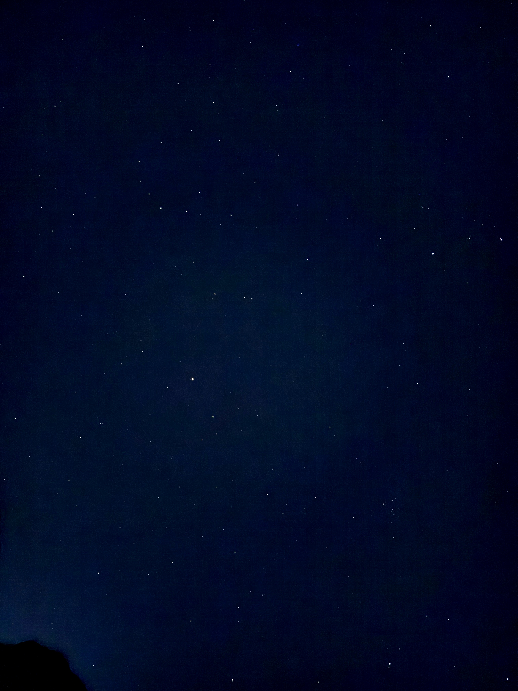

# ✦ Star Enhancer

Browser-based night-sky photo enhancer. Drop a photo, get cleaner stars — runs **fully in your browser** via WebAssembly. Nothing is uploaded.

**Live demo:** https://sejas.github.io/stargazing-improve-pictures/



## What it does

Takes a noisy, washed-out night-sky photo and:

1. **Flattens the light-pollution / vignette gradient** — models the large-scale background (downsample → blur → upsample) and subtracts it, so the sky is an even deep navy instead of a blue-grey haze.
2. **Denoises color** — blurs only the chroma channels, keeping star points sharp.
3. **Denoises luminance** — smooths the dark sky while a detail mask preserves the stars.
4. **Pops the stars** — isolates point sources with a high-pass and lifts them.
5. **Stretches contrast** (black point + `asinh`) — pulls faint stars up while holding the background dark.
6. **Boosts saturation** — brings out star color.

All tunable live with sliders: star lift, saturation, black point, stretch.

## How it works

The image math is plain **numpy + Pillow** — the exact same pipeline as the local [`enhance.py`](enhance.py). In the browser, those libraries run as **WebAssembly** via [Pyodide](https://pyodide.org), loaded from a CDN. No server, no upload — the photo never leaves your machine.

Big photos are downscaled to a 2600px long edge to stay within the WASM heap.

## Run locally

```bash
python3 -m http.server 8000
# open http://localhost:8000
```

> A plain `file://` open won't work — the ES module + CDN fetch need `http`.

## Run the CLI version

```bash
pip3 install numpy pillow
python3 enhance.py     # reads IMG_6173.jpeg, writes IMG_6173-stars.jpeg
```

## Supported formats

Any format Pillow can decode: JPEG, PNG, WebP, TIFF, BMP, GIF. (HEIC may need converting first.)

---

Made with love from the Canary Islands 🇮🇨 by [Antonio Sejas](https://sejas.blog)
